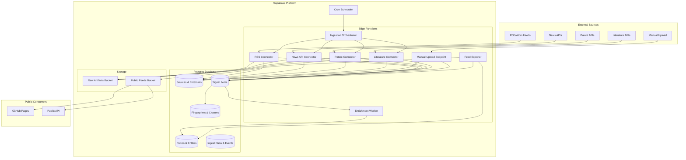

# Design Document: News Database Curation System (Formul8 Signals)

## Overview

The News Database Curation System (Formul8 Signals) is a multi-source ingestion platform built on Supabase that collects, normalizes, deduplicates, enriches, and publishes news articles, patents, and scientific literature. The system serves as a canonical system of record using Postgres as the database, Supabase Storage for artifacts, and Edge Functions for serverless orchestration.

### Key Design Goals

1. **Multi-Source Ingestion**: Support diverse signal sources (RSS/Atom feeds, News APIs, Patent APIs, Literature APIs, manual uploads)
2. **License Compliance**: Enforce per-source license policies at ingestion time to ensure legal compliance
3. **Deduplication**: Detect hard duplicates via content fingerprinting and cluster near-duplicates via similarity scoring
4. **Enrichment**: Automatically detect language, extract topics and entities, generate summaries, and compute embeddings
5. **Public Distribution**: Export policy-safe feeds for consumption by GitHub Pages and other downstream systems
6. **Observability**: Track ingestion jobs, errors, and metrics for system health monitoring
7. **Phased Delivery**: Support incremental deployment across three phases

### System Boundaries

**In Scope:**
- Ingestion orchestration via Supabase Edge Functions
- Data storage in Supabase Postgres with pgvector extension
- Raw artifact storage in Supabase Storage buckets
- Deduplication engine (hard and near-duplicate detection)
- Enrichment pipeline (language, topics, entities, summaries, embeddings)
- Feed export to public JSON files
- Row-level security policies for data access control
- Cron-based scheduling for periodic ingestion

**Out of Scope:**
- Frontend UI for browsing signals (handled by separate GitHub Pages site)
- Real-time streaming ingestion (system uses scheduled polling)
- Machine learning model training (uses pre-trained models for enrichment)
- Content moderation and filtering (assumes source-level curation)

## Architecture

### High-Level Architecture

The system follows a serverless architecture pattern using Supabase components:



### Data Flow


**Ingestion Flow:**

1. Cron scheduler triggers ingestion orchestrator at configured intervals
2. Orchestrator creates Ingest_Run record and invokes appropriate connector
3. Connector fetches data from external source (RSS feed, API endpoint)
4. Connector normalizes data into Signal_Item records
5. System computes content fingerprint and checks for hard duplicates
6. If not duplicate, system stores Signal_Item in Postgres and raw content in Storage
7. System applies license policy to determine what content to store
8. System logs Ingest_Item_Event for each processed item
9. Orchestrator updates Ingest_Run with completion status

**Enrichment Flow:**

1. Enrichment worker queries for unenriched Signal_Items
2. Worker detects language using language detection library
3. Worker extracts topics using keyword matching and classification
4. Worker extracts named entities using NER models
5. Worker generates summary using summarization model (if content length > 1000 chars)
6. Worker computes vector embeddings using embedding model
7. Worker computes similarity scores against recent items for clustering
8. Worker updates Signal_Item with enrichment data
9. Worker creates Topic, Entity, and Cluster association records

**Export Flow:**

1. Feed exporter runs on daily schedule
2. Exporter queries Signal_Items filtered by license policy compliance
3. Exporter generates index.json with feed metadata
4. Exporter generates monthly archive files (YYYY-MM.json)
5. Exporter generates topic-filtered feeds (topic-{name}.json)
6. Exporter generates entity-filtered feeds (entity-{id}.json)
7. Exporter uploads all JSON files to public Storage bucket
8. Public consumers (GitHub Pages) fetch feeds from Storage bucket

### Technology Stack

- **Database**: Supabase Postgres 15+ with pgvector extension
- **Storage**: Supabase Storage with public and private buckets
- **Compute**: Supabase Edge Functions (Deno runtime)
- **Scheduling**: Supabase Cron (pg_cron extension)
- **Security**: Supabase Row-Level Security (RLS) policies
- **Language Detection**: lingua-js or similar library
- **NER**: compromise-js or similar lightweight NER library
- **Embeddings**: OpenAI text-embedding-3-small or similar API
- **Summarization**: OpenAI GPT-4o-mini or similar API

## Components and Interfaces

### Edge Functions

#### 1. Ingestion Orchestrator (`ingest-orchestrator`)

**Purpose**: Coordinates ingestion across all configured source endpoints

**Trigger**: Invoked by cron scheduler or manual API call

**Interface**:
```typescript
// Request
POST /functions/v1/ingest-orchestrator
{
  "source_endpoint_id"?: string,  // Optional: specific endpoint to ingest
  "mode": "streaming" | "backfill"
}

// Response
{
  "ingest_run_id": string,
  "status": "started" | "completed" | "failed",
  "endpoints_processed": number,
  "items_created": number,
  "items_skipped": number,
  "errors": Array<{endpoint_id: string, error: string}>
}
```

**Responsibilities**:
- Query active Source_Endpoint records
- Create Ingest_Run record for tracking
- Invoke appropriate connector based on source type
- Aggregate results and update Ingest_Run status
- Handle errors and retries with exponential backoff

#### 2. RSS Connector (`ingest-rss`)

**Purpose**: Fetch and parse RSS/Atom feeds

**Trigger**: Invoked by orchestrator

**Interface**:
```typescript
// Request
POST /functions/v1/ingest-rss
{
  "source_endpoint_id": string,
  "ingest_run_id": string,
  "mode": "streaming" | "backfill"
}

// Response
{
  "items_processed": number,
  "items_created": number,
  "items_duplicate": number,
  "errors": Array<{item_link: string, error: string}>
}
```

**Responsibilities**:
- Fetch RSS/Atom feed from endpoint URL
- Parse RSS 2.0 and Atom 1.0 formats
- Extract title, link, pubDate, author, description, content
- Normalize into News_Item records
- Create Signal_Item and Provenance records
- Compute fingerprint and check for duplicates
- Apply license policy for content storage
- Log Ingest_Item_Event records

#### 3. News API Connector (`ingest-news-api`)

**Purpose**: Fetch news from premium API sources

**Trigger**: Invoked by orchestrator

**Interface**:
```typescript
// Request
POST /functions/v1/ingest-news-api
{
  "source_endpoint_id": string,
  "ingest_run_id": string,
  "mode": "streaming" | "backfill",
  "from_date"?: string,  // ISO 8601 date for backfill
  "to_date"?: string
}

// Response
{
  "items_processed": number,
  "items_created": number,
  "items_duplicate": number,
  "rate_limit_remaining": number,
  "errors": Array<{item_id: string, error: string}>
}
```

**Responsibilities**:
- Authenticate with News API using credentials
- Query API with configured search parameters
- Handle pagination for large result sets
- Store raw API response in Storage bucket
- Normalize into News_Item records
- Handle rate limiting with retry logic
- Apply license policy for content storage

#### 4. Patent Connector (`ingest-patents`)

**Purpose**: Fetch patent data from patent databases

**Trigger**: Invoked by orchestrator

**Interface**:
```typescript
// Request
POST /functions/v1/ingest-patents
{
  "source_endpoint_id": string,
  "ingest_run_id": string,
  "search_query": string,
  "from_date"?: string
}

// Response
{
  "items_processed": number,
  "items_created": number,
  "families_identified": number,
  "errors": Array<{patent_number: string, error: string}>
}
```

**Responsibilities**:
- Query patent API with search criteria
- Parse patent records (application number, title, abstract, claims, inventors, assignees)
- Extract patent family identifiers
- Create Patent_Item and Signal_Item records
- Create Cluster records for patent families
- Apply license policy for content storage

#### 5. Literature Connector (`ingest-literature`)

**Purpose**: Fetch scientific papers from literature databases

**Trigger**: Invoked by orchestrator

**Interface**:
```typescript
// Request
POST /functions/v1/ingest-literature
{
  "source_endpoint_id": string,
  "ingest_run_id": string,
  "search_query": string,
  "from_date"?: string
}

// Response
{
  "items_processed": number,
  "items_created": number,
  "full_text_downloaded": number,
  "errors": Array<{doi: string, error: string}>
}
```

**Responsibilities**:
- Query literature API with search criteria
- Parse paper metadata (DOI, title, abstract, authors, journal, citation count)
- Download full text for open access papers (if license allows)
- Create Paper_Item and Signal_Item records
- Apply license policy for content storage

#### 6. Manual Upload Endpoint (`upload-manual`)

**Purpose**: Accept manually uploaded signals

**Trigger**: API call from admin interface

**Interface**:
```typescript
// Request
POST /functions/v1/upload-manual
{
  "items": Array<{
    "type": "news" | "patent" | "paper",
    "data": NewsItem | PatentItem | PaperItem
  }>,
  "uploaded_by": string
}

// Response
{
  "items_accepted": number,
  "items_rejected": number,
  "errors": Array<{index: number, error: string}>
}
```

**Responsibilities**:
- Validate item structure based on type
- Create Source record with type "Manual"
- Create Signal_Item and Provenance records
- Support batch uploads
- Return validation errors for rejected items

#### 7. Enrichment Worker (`enrich-signals`)

**Purpose**: Perform enrichment tasks on unenriched signals

**Trigger**: Invoked by cron scheduler or after ingestion

**Interface**:
```typescript
// Request
POST /functions/v1/enrich-signals
{
  "batch_size"?: number,  // Default: 50
  "signal_ids"?: Array<string>  // Optional: specific signals to enrich
}

// Response
{
  "signals_processed": number,
  "language_detected": number,
  "topics_extracted": number,
  "entities_extracted": number,
  "summaries_generated": number,
  "embeddings_computed": number,
  "clusters_created": number,
  "errors": Array<{signal_id: string, error: string}>
}
```

**Responsibilities**:
- Query unenriched Signal_Items (batch processing)
- Detect language and store ISO 639-1 code
- Extract topics and create Signal_Topic associations
- Extract named entities and create Signal_Entity associations
- Generate summaries for content > 1000 characters
- Compute vector embeddings (respecting license policy)
- Compute similarity scores and create Cluster records
- Update Signal_Item with enrichment status

#### 8. Feed Exporter (`export-feeds`)

**Purpose**: Generate public JSON feeds from policy-compliant signals

**Trigger**: Invoked by daily cron schedule

**Interface**:
```typescript
// Request
POST /functions/v1/export-feeds
{
  "export_types": Array<"index" | "monthly" | "topics" | "entities">
}

// Response
{
  "index_generated": boolean,
  "monthly_archives": Array<string>,  // ["2024-01.json", "2024-02.json"]
  "topic_feeds": Array<string>,       // ["topic-ai.json", "topic-climate.json"]
  "entity_feeds": Array<string>,      // ["entity-123.json", "entity-456.json"]
  "errors": Array<{feed: string, error: string}>
}
```

**Responsibilities**:
- Query Signal_Items filtered by license policy compliance
- Generate index.json with feed metadata
- Generate monthly archive files (YYYY-MM.json)
- Generate topic-filtered feeds (topic-{name}.json)
- Generate entity-filtered feeds for high-frequency entities (>= 10 mentions)
- Apply license policy restrictions (link_only sources exclude content)
- Upload JSON files to public Storage bucket
- Set appropriate cache headers and permissions

### Storage Bucket Organization

#### Private Bucket: `raw-artifacts`

**Purpose**: Store raw ingestion artifacts for audit and reprocessing

**Structure**:
```
raw-artifacts/
├── rss/
│   ├── {source_id}/
│   │   ├── {endpoint_id}/
│   │   │   ├── {YYYY-MM-DD-HH-mm-ss}.xml
├── news-api/
│   ├── {source_id}/
│   │   ├── {endpoint_id}/
│   │   │   ├── {YYYY-MM-DD-HH-mm-ss}.json
├── patents/
│   ├── {source_id}/
│   │   ├── {YYYY-MM-DD-HH-mm-ss}.json
├── literature/
│   ├── {source_id}/
│   │   ├── {doi_hash}/
│   │   │   ├── metadata.json
│   │   │   ├── fulltext.pdf  // Only for open access + allowed by policy
```

**Access**: Private, accessible only by Edge Functions with service role key

**Retention**: 90 days (configurable)

#### Public Bucket: `public-feeds`

**Purpose**: Host policy-safe JSON feeds for public consumption

**Structure**:
```
public-feeds/
├── index.json
├── archives/
│   ├── 2024-01.json
│   ├── 2024-02.json
│   ├── 2024-03.json
├── topics/
│   ├── topic-ai.json
│   ├── topic-climate.json
│   ├── topic-healthcare.json
├── entities/
│   ├── entity-123.json
│   ├── entity-456.json
```

**Access**: Public read, write only by Edge Functions

**Cache Headers**: `Cache-Control: public, max-age=3600`

## Data Models

### Postgres Schema

#### Table: `sources`

Stores configuration for ingestion sources.

```sql
CREATE TABLE sources (
  id UUID PRIMARY KEY DEFAULT gen_random_uuid(),
  name TEXT NOT NULL,
  type TEXT NOT NULL CHECK (type IN ('RSS', 'News_API', 'Patent_API', 'Literature_API', 'Manual')),
  description TEXT,
  license_policy JSONB NOT NULL,  -- {store_full_text_allowed, snippet_only, link_only}
  created_at TIMESTAMPTZ NOT NULL DEFAULT NOW(),
  updated_at TIMESTAMPTZ NOT NULL DEFAULT NOW()
);

CREATE INDEX idx_sources_type ON sources(type);
```

**License Policy Structure**:
```json
{
  "mode": "store_full_text_allowed" | "snippet_only" | "link_only",
  "snippet_length": 500,  // Only for snippet_only mode
  "attribution_required": true,
  "redistribution_allowed": false
}
```

#### Table: `source_endpoints`

Stores specific endpoints or feeds within a source.

```sql
CREATE TABLE source_endpoints (
  id UUID PRIMARY KEY DEFAULT gen_random_uuid(),
  source_id UUID NOT NULL REFERENCES sources(id) ON DELETE CASCADE,
  name TEXT NOT NULL,
  endpoint_url TEXT NOT NULL,
  auth_config JSONB,  -- {type: "api_key" | "oauth", credentials: {...}}
  polling_schedule TEXT,  -- Cron expression
  is_active BOOLEAN NOT NULL DEFAULT true,
  last_ingested_at TIMESTAMPTZ,
  created_at TIMESTAMPTZ NOT NULL DEFAULT NOW(),
  updated_at TIMESTAMPTZ NOT NULL DEFAULT NOW()
);

CREATE INDEX idx_source_endpoints_source_id ON source_endpoints(source_id);
CREATE INDEX idx_source_endpoints_active ON source_endpoints(is_active) WHERE is_active = true;
```

#### Table: `signal_items`

Canonical record for all signals (news, patents, papers).

```sql
CREATE TABLE signal_items (
  id UUID PRIMARY KEY DEFAULT gen_random_uuid(),
  type TEXT NOT NULL CHECK (type IN ('news', 'patent', 'paper')),
  title TEXT NOT NULL,
  url TEXT,
  published_at TIMESTAMPTZ,
  content_snippet TEXT,  -- First 500 chars or full content based on license
  summary TEXT,
  language_code TEXT,  -- ISO 639-1
  language_confidence FLOAT,
  embedding VECTOR(1536),  -- pgvector for semantic search
  enrichment_status TEXT NOT NULL DEFAULT 'pending' CHECK (enrichment_status IN ('pending', 'in_progress', 'completed', 'failed')),
  enriched_at TIMESTAMPTZ,
  created_at TIMESTAMPTZ NOT NULL DEFAULT NOW(),
  updated_at TIMESTAMPTZ NOT NULL DEFAULT NOW()
);

CREATE INDEX idx_signal_items_type ON signal_items(type);
CREATE INDEX idx_signal_items_published_at ON signal_items(published_at DESC);
CREATE INDEX idx_signal_items_enrichment_status ON signal_items(enrichment_status) WHERE enrichment_status = 'pending';
CREATE INDEX idx_signal_items_embedding ON signal_items USING ivfflat (embedding vector_cosine_ops);
```

#### Table: `news_items`

Type-specific data for news articles.

```sql
CREATE TABLE news_items (
  id UUID PRIMARY KEY DEFAULT gen_random_uuid(),
  signal_item_id UUID NOT NULL REFERENCES signal_items(id) ON DELETE CASCADE,
  author TEXT,
  source_name TEXT,
  content_full TEXT,  -- Only stored if license allows
  created_at TIMESTAMPTZ NOT NULL DEFAULT NOW()
);

CREATE INDEX idx_news_items_signal_id ON news_items(signal_item_id);
```

#### Table: `patent_items`

Type-specific data for patents.

```sql
CREATE TABLE patent_items (
  id UUID PRIMARY KEY DEFAULT gen_random_uuid(),
  signal_item_id UUID NOT NULL REFERENCES signal_items(id) ON DELETE CASCADE,
  application_number TEXT NOT NULL,
  patent_family_id TEXT,
  abstract TEXT,
  claims TEXT,
  inventors TEXT[],
  assignees TEXT[],
  filing_date DATE,
  grant_date DATE,
  created_at TIMESTAMPTZ NOT NULL DEFAULT NOW()
);

CREATE INDEX idx_patent_items_signal_id ON patent_items(signal_item_id);
CREATE INDEX idx_patent_items_application_number ON patent_items(application_number);
CREATE INDEX idx_patent_items_family_id ON patent_items(patent_family_id);
```

#### Table: `paper_items`

Type-specific data for scientific literature.

```sql
CREATE TABLE paper_items (
  id UUID PRIMARY KEY DEFAULT gen_random_uuid(),
  signal_item_id UUID NOT NULL REFERENCES signal_items(id) ON DELETE CASCADE,
  doi TEXT,
  abstract TEXT,
  authors TEXT[],
  journal TEXT,
  citation_count INTEGER,
  is_open_access BOOLEAN,
  created_at TIMESTAMPTZ NOT NULL DEFAULT NOW()
);

CREATE INDEX idx_paper_items_signal_id ON paper_items(signal_item_id);
CREATE INDEX idx_paper_items_doi ON paper_items(doi);
```

#### Table: `provenance_records`

Tracks origin and ingestion metadata for each signal.

```sql
CREATE TABLE provenance_records (
  id UUID PRIMARY KEY DEFAULT gen_random_uuid(),
  signal_item_id UUID NOT NULL REFERENCES signal_items(id) ON DELETE CASCADE,
  source_id UUID NOT NULL REFERENCES sources(id),
  source_endpoint_id UUID REFERENCES source_endpoints(id),
  ingest_run_id UUID REFERENCES ingest_runs(id),
  ingested_at TIMESTAMPTZ NOT NULL DEFAULT NOW(),
  uploaded_by TEXT,  -- For manual uploads
  raw_artifact_path TEXT,  -- Path in Storage bucket
  created_at TIMESTAMPTZ NOT NULL DEFAULT NOW()
);

CREATE INDEX idx_provenance_signal_id ON provenance_records(signal_item_id);
CREATE INDEX idx_provenance_source_id ON provenance_records(source_id);
CREATE INDEX idx_provenance_endpoint_id ON provenance_records(source_endpoint_id);
```

#### Table: `signal_fingerprints`

Stores content hashes for hard duplicate detection.

```sql
CREATE TABLE signal_fingerprints (
  id UUID PRIMARY KEY DEFAULT gen_random_uuid(),
  signal_item_id UUID NOT NULL REFERENCES signal_items(id) ON DELETE CASCADE,
  fingerprint_hash TEXT NOT NULL,  -- SHA-256 of normalized content
  created_at TIMESTAMPTZ NOT NULL DEFAULT NOW(),
  UNIQUE(fingerprint_hash)
);

CREATE INDEX idx_fingerprints_hash ON signal_fingerprints(fingerprint_hash);
CREATE INDEX idx_fingerprints_signal_id ON signal_fingerprints(signal_item_id);
```

#### Table: `clusters`

Groups near-duplicate signals.

```sql
CREATE TABLE clusters (
  id UUID PRIMARY KEY DEFAULT gen_random_uuid(),
  canonical_signal_id UUID NOT NULL REFERENCES signal_items(id),
  cluster_type TEXT NOT NULL CHECK (cluster_type IN ('near_duplicate', 'patent_family', 'topic_group')),
  created_at TIMESTAMPTZ NOT NULL DEFAULT NOW(),
  updated_at TIMESTAMPTZ NOT NULL DEFAULT NOW()
);

CREATE INDEX idx_clusters_canonical_signal ON clusters(canonical_signal_id);
```

#### Table: `cluster_members`

Associates signals with clusters.

```sql
CREATE TABLE cluster_members (
  id UUID PRIMARY KEY DEFAULT gen_random_uuid(),
  cluster_id UUID NOT NULL REFERENCES clusters(id) ON DELETE CASCADE,
  signal_item_id UUID NOT NULL REFERENCES signal_items(id) ON DELETE CASCADE,
  similarity_score FLOAT,  -- 0.0 to 1.0
  created_at TIMESTAMPTZ NOT NULL DEFAULT NOW(),
  UNIQUE(cluster_id, signal_item_id)
);

CREATE INDEX idx_cluster_members_cluster_id ON cluster_members(cluster_id);
CREATE INDEX idx_cluster_members_signal_id ON cluster_members(signal_item_id);
```

#### Table: `topics`

Predefined taxonomy of subject areas.

```sql
CREATE TABLE topics (
  id UUID PRIMARY KEY DEFAULT gen_random_uuid(),
  name TEXT NOT NULL UNIQUE,
  description TEXT,
  parent_topic_id UUID REFERENCES topics(id),
  created_at TIMESTAMPTZ NOT NULL DEFAULT NOW()
);

CREATE INDEX idx_topics_name ON topics(name);
CREATE INDEX idx_topics_parent ON topics(parent_topic_id);
```

**Predefined Topics**:
- AI (Artificial Intelligence)
- Climate (Climate Change & Environment)
- Healthcare (Medicine & Health)
- Energy (Energy & Sustainability)
- Finance (Financial Markets & Economics)
- Technology (General Technology)
- Science (General Science)

#### Table: `signal_topics`

Associates signals with topics.

```sql
CREATE TABLE signal_topics (
  id UUID PRIMARY KEY DEFAULT gen_random_uuid(),
  signal_item_id UUID NOT NULL REFERENCES signal_items(id) ON DELETE CASCADE,
  topic_id UUID NOT NULL REFERENCES topics(id) ON DELETE CASCADE,
  confidence FLOAT,  -- 0.0 to 1.0
  created_at TIMESTAMPTZ NOT NULL DEFAULT NOW(),
  UNIQUE(signal_item_id, topic_id)
);

CREATE INDEX idx_signal_topics_signal_id ON signal_topics(signal_item_id);
CREATE INDEX idx_signal_topics_topic_id ON signal_topics(topic_id);
```

#### Table: `entities`

Named entities extracted from content.

```sql
CREATE TABLE entities (
  id UUID PRIMARY KEY DEFAULT gen_random_uuid(),
  name TEXT NOT NULL,
  canonical_name TEXT NOT NULL,  -- Normalized form
  entity_type TEXT NOT NULL CHECK (entity_type IN ('person', 'organization', 'location')),
  metadata JSONB,  -- Additional entity info
  created_at TIMESTAMPTZ NOT NULL DEFAULT NOW(),
  UNIQUE(canonical_name, entity_type)
);

CREATE INDEX idx_entities_canonical_name ON entities(canonical_name);
CREATE INDEX idx_entities_type ON entities(entity_type);
```

#### Table: `signal_entities`

Associates signals with entities.

```sql
CREATE TABLE signal_entities (
  id UUID PRIMARY KEY DEFAULT gen_random_uuid(),
  signal_item_id UUID NOT NULL REFERENCES signal_items(id) ON DELETE CASCADE,
  entity_id UUID NOT NULL REFERENCES entities(id) ON DELETE CASCADE,
  mention_count INTEGER NOT NULL DEFAULT 1,
  created_at TIMESTAMPTZ NOT NULL DEFAULT NOW(),
  UNIQUE(signal_item_id, entity_id)
);

CREATE INDEX idx_signal_entities_signal_id ON signal_entities(signal_item_id);
CREATE INDEX idx_signal_entities_entity_id ON signal_entities(entity_id);
```

#### Table: `ingest_runs`

Tracks ingestion job execution.

```sql
CREATE TABLE ingest_runs (
  id UUID PRIMARY KEY DEFAULT gen_random_uuid(),
  source_endpoint_id UUID REFERENCES source_endpoints(id),
  mode TEXT NOT NULL CHECK (mode IN ('streaming', 'backfill')),
  status TEXT NOT NULL DEFAULT 'started' CHECK (status IN ('started', 'in_progress', 'completed', 'partial', 'failed')),
  started_at TIMESTAMPTZ NOT NULL DEFAULT NOW(),
  completed_at TIMESTAMPTZ,
  items_processed INTEGER NOT NULL DEFAULT 0,
  items_created INTEGER NOT NULL DEFAULT 0,
  items_duplicate INTEGER NOT NULL DEFAULT 0,
  items_error INTEGER NOT NULL DEFAULT 0,
  error_message TEXT,
  created_at TIMESTAMPTZ NOT NULL DEFAULT NOW()
);

CREATE INDEX idx_ingest_runs_endpoint_id ON ingest_runs(source_endpoint_id);
CREATE INDEX idx_ingest_runs_status ON ingest_runs(status);
CREATE INDEX idx_ingest_runs_started_at ON ingest_runs(started_at DESC);
```

#### Table: `ingest_item_events`

Event log for each item processed during ingestion.

```sql
CREATE TABLE ingest_item_events (
  id UUID PRIMARY KEY DEFAULT gen_random_uuid(),
  ingest_run_id UUID NOT NULL REFERENCES ingest_runs(id) ON DELETE CASCADE,
  signal_item_id UUID REFERENCES signal_items(id),
  event_type TEXT NOT NULL CHECK (event_type IN ('created', 'duplicate', 'error', 'skipped')),
  item_identifier TEXT,  -- URL, DOI, or other external ID
  error_message TEXT,
  created_at TIMESTAMPTZ NOT NULL DEFAULT NOW()
);

CREATE INDEX idx_ingest_events_run_id ON ingest_item_events(ingest_run_id);
CREATE INDEX idx_ingest_events_signal_id ON ingest_item_events(signal_item_id);
CREATE INDEX idx_ingest_events_type ON ingest_item_events(event_type);
```

### Row-Level Security Policies

#### Policy: Public Read Access to Compliant Signals

```sql
-- Enable RLS on signal_items
ALTER TABLE signal_items ENABLE ROW LEVEL SECURITY;

-- Public users can only read signals from sources with public distribution allowed
CREATE POLICY "Public read access to compliant signals"
ON signal_items
FOR SELECT
TO anon
USING (
  EXISTS (
    SELECT 1 FROM provenance_records pr
    JOIN sources s ON pr.source_id = s.id
    WHERE pr.signal_item_id = signal_items.id
    AND (s.license_policy->>'redistribution_allowed')::boolean = true
  )
);

-- Authenticated internal users can read all signals
CREATE POLICY "Internal full access"
ON signal_items
FOR ALL
TO authenticated
USING (true);
```

#### Policy: Content Filtering Based on License

```sql
-- Enable RLS on news_items
ALTER TABLE news_items ENABLE ROW LEVEL SECURITY;

-- Public users cannot access full content for snippet_only or link_only sources
CREATE POLICY "Public content filtering"
ON news_items
FOR SELECT
TO anon
USING (
  EXISTS (
    SELECT 1 FROM signal_items si
    JOIN provenance_records pr ON pr.signal_item_id = si.id
    JOIN sources s ON pr.source_id = s.id
    WHERE si.id = news_items.signal_item_id
    AND (s.license_policy->>'mode') = 'store_full_text_allowed'
    AND (s.license_policy->>'redistribution_allowed')::boolean = true
  )
);

-- Internal users can access all content
CREATE POLICY "Internal full content access"
ON news_items
FOR ALL
TO authenticated
USING (true);
```

### Cron Scheduling Strategy

Supabase uses pg_cron extension for scheduling. Configuration stored in `supabase/migrations/`:

```sql
-- Schedule RSS ingestion every 15 minutes
SELECT cron.schedule(
  'ingest-rss-feeds',
  '*/15 * * * *',
  $$
  SELECT net.http_post(
    url := 'https://[project-ref].supabase.co/functions/v1/ingest-orchestrator',
    headers := '{"Authorization": "Bearer [service-role-key]", "Content-Type": "application/json"}'::jsonb,
    body := '{"mode": "streaming"}'::jsonb
  );
  $$
);

-- Schedule enrichment worker every 5 minutes
SELECT cron.schedule(
  'enrich-signals',
  '*/5 * * * *',
  $$
  SELECT net.http_post(
    url := 'https://[project-ref].supabase.co/functions/v1/enrich-signals',
    headers := '{"Authorization": "Bearer [service-role-key]", "Content-Type": "application/json"}'::jsonb,
    body := '{"batch_size": 50}'::jsonb
  );
  $$
);

-- Schedule feed export daily at 2 AM UTC
SELECT cron.schedule(
  'export-public-feeds',
  '0 2 * * *',
  $$
  SELECT net.http_post(
    url := 'https://[project-ref].supabase.co/functions/v1/export-feeds',
    headers := '{"Authorization": "Bearer [service-role-key]", "Content-Type": "application/json"}'::jsonb,
    body := '{"export_types": ["index", "monthly", "topics", "entities"]}'::jsonb
  );
  $$
);
```

### Security Model

**Authentication Layers**:
1. **Service Role Key**: Used by Edge Functions for internal operations (full access)
2. **Anon Key**: Used by public API consumers (RLS-restricted access)
3. **Authenticated Users**: Used by admin interface (full access with audit logging)

**RLS Enforcement**:
- All tables with public-facing data have RLS enabled
- Public queries automatically filtered by license policy
- Internal queries bypass RLS using service role
- RLS policies validated in CI/CD pipeline

**API Security**:
- Edge Functions require authentication header
- Rate limiting enforced at Supabase edge
- CORS configured for GitHub Pages domain
- Storage buckets have separate public/private access

**Data Privacy**:
- PII not collected or stored
- Raw artifacts retained for 90 days only
- Audit logs track all data access
- License policies enforced at ingestion time


## Correctness Properties

*A property is a characteristic or behavior that should hold true across all valid executions of a system—essentially, a formal statement about what the system should do. Properties serve as the bridge between human-readable specifications and machine-verifiable correctness guarantees.*

### Property 1: Source Configuration Persistence Round-Trip

*For any* valid Source or Source_Endpoint configuration, creating the record then retrieving it SHALL produce an equivalent configuration with all fields preserved.

**Validates: Requirements 1.1, 1.3, 1.4, 9.5, 15.4**

### Property 2: License Policy Validation

*For any* Source creation attempt, if the License_Policy does not specify exactly one of (store_full_text_allowed, snippet_only, link_only), the system SHALL reject the creation.

**Validates: Requirements 1.2**

### Property 3: Source Configuration Update Preserves Data

*For any* existing Source or Source_Endpoint record, updating specific fields SHALL preserve all other fields unchanged.

**Validates: Requirements 1.5**

### Property 4: RSS/Atom Feed Parsing Round-Trip

*For any* valid News_Item object, formatting to RSS 2.0 then parsing then formatting SHALL produce an equivalent RSS document.

**Validates: Requirements 2.7**

### Property 5: Feed Parsing Extracts Required Fields

*For any* valid RSS 2.0 or Atom 1.0 feed entry, parsing SHALL produce a News_Item with all required fields (title, link, publication date, author, description, content) present.

**Validates: Requirements 2.2, 2.3**

### Property 6: Type-Specific Item Creation Produces Associated Records

*For any* News_Item, Patent_Item, or Paper_Item created through ingestion, the system SHALL create a corresponding Signal_Item record with the correct type and a Provenance_Record linking to the Source_Endpoint.

**Validates: Requirements 2.4, 4.4, 5.5**

### Property 7: Feed Parsing Errors Do Not Stop Processing

*For any* batch of feed entries where some entries fail parsing, the system SHALL log errors for failed entries and successfully process all valid entries.

**Validates: Requirements 2.5**

### Property 8: API Response Normalization Produces Required Fields

*For any* valid API response (News_API, Patent_API, Literature_API), normalization SHALL produce a type-specific item with all required fields present.

**Validates: Requirements 3.3, 4.2, 5.2**

### Property 9: Raw API Responses Are Stored

*For any* News_Item created from a News_API, the system SHALL store the raw API response in Storage_Bucket with a path recorded in the Provenance_Record.

**Validates: Requirements 3.4**

### Property 10: Patent Family Clustering

*For any* set of Patent_Items with the same patent_family_id, the system SHALL create a Cluster record linking all patents in the family.

**Validates: Requirements 4.3**

### Property 11: License Policy Enforcement at Ingestion

*For any* Signal_Item ingested with a License_Policy of:
- store_full_text_allowed: full content SHALL be stored
- snippet_only: only first 500 characters SHALL be stored
- link_only: only URL and metadata SHALL be stored, no content

**Validates: Requirements 7.2, 7.3, 7.4, 4.5, 5.4**

### Property 12: Open Access and Policy Determine Full Text Storage

*For any* Paper_Item, full text SHALL be downloaded and stored if and only if the paper is open access AND the License_Policy allows full text storage.

**Validates: Requirements 5.3**

### Property 13: Manual Upload Validation

*For any* manual upload request, items missing required fields for their type SHALL be rejected with descriptive errors, and valid items SHALL be accepted.

**Validates: Requirements 6.2**

### Property 14: Manual Upload Creates Manual Source

*For any* manually uploaded item, the system SHALL create or reuse a Source record with type "Manual" and create a Provenance_Record indicating manual upload and the uploading user.

**Validates: Requirements 6.3, 6.4**

### Property 15: Batch Manual Upload Processes All Items

*For any* batch manual upload request, all valid items SHALL be created and all invalid items SHALL be rejected with individual error messages.

**Validates: Requirements 6.5**

### Property 16: License Policy Recorded for Audit

*For any* Signal_Item created, the applied License_Policy SHALL be recorded in the Signal_Item or Provenance_Record for audit purposes.

**Validates: Requirements 7.5**

### Property 17: Content Fingerprint Computation

*For any* Signal_Item ingested, the system SHALL compute a SHA-256 fingerprint of normalized content and create a Signal_Fingerprint record.

**Validates: Requirements 8.1, 8.2**

### Property 18: Hard Duplicate Detection

*For any* Signal_Item with a fingerprint matching an existing Signal_Fingerprint, the system SHALL mark it as a duplicate, link it to the original, skip content storage, and log a duplicate event.

**Validates: Requirements 8.3, 8.4, 8.5**

### Property 19: Near-Duplicate Similarity Computation

*For any* Signal_Item that passes hard duplicate detection, the system SHALL compute similarity scores against recent Signal_Items of the same type.

**Validates: Requirements 9.1**

### Property 20: Clustering by Similarity Threshold

*For any* pair of Signal_Items with similarity score exceeding 85%, the system SHALL create or update a Cluster record and create Cluster_Member records for both items.

**Validates: Requirements 9.2, 9.3**

### Property 21: Canonical Cluster Representative

*For any* Cluster, the Signal_Item with the earliest published_at timestamp SHALL be designated as the canonical representative.

**Validates: Requirements 9.4**

### Property 22: Language Detection and Storage

*For any* Signal_Item created, the system SHALL detect the language and store a valid ISO 639-1 language code in the Signal_Item record.

**Validates: Requirements 10.1, 10.2**

### Property 23: Low Confidence Language Marking

*For any* Signal_Item where language detection confidence is below 80%, the system SHALL mark the language as "unknown".

**Validates: Requirements 10.3**

### Property 24: Query Filtering by Attributes

*For any* query filtering Signal_Items by language, topic, or entity, the system SHALL return only Signal_Items that have the specified attribute.

**Validates: Requirements 10.4, 11.5, 12.4**

### Property 25: Topic Extraction and Association

*For any* Signal_Item enriched, the system SHALL extract topics from title and content, create Topic records for new topics, and create Signal_Topic association records.

**Validates: Requirements 11.1, 11.2**

### Property 26: Multi-Topic Association

*For any* Signal_Item matching multiple topics, the system SHALL create multiple Signal_Topic association records.

**Validates: Requirements 11.4**

### Property 27: Entity Extraction and Association

*For any* Signal_Item enriched, the system SHALL extract named entities (person, organization, location), create Entity records for new entities, and create Signal_Entity association records.

**Validates: Requirements 12.1, 12.2**

### Property 28: Entity Name Normalization

*For any* set of entity name variations referring to the same entity (e.g., "IBM", "International Business Machines"), the system SHALL map them to the same canonical Entity record.

**Validates: Requirements 12.3**

### Property 29: Conditional Summary Generation

*For any* Signal_Item with content exceeding 1000 characters and a License_Policy permitting content access, the system SHALL generate a summary of 200 characters or fewer and store it in the Signal_Item record.

**Validates: Requirements 13.1, 13.2, 13.3**

### Property 30: Summary Inclusion in Exports

*For any* Signal_Item with a summary, Public_Feed exports SHALL include the summary field.

**Validates: Requirements 13.4**

### Property 31: Conditional Embedding Computation

*For any* Signal_Item from a Source with embeddings enabled and a License_Policy permitting content access, the system SHALL compute vector embeddings and store them in Postgres_DB as pgvector type.

**Validates: Requirements 14.1, 14.2, 14.4**

### Property 32: Semantic Similarity Query

*For any* vector similarity query, the system SHALL return Signal_Items ordered by vector distance (closest first).

**Validates: Requirements 14.3**

### Property 33: Ingest Run Tracking

*For any* ingestion execution, the system SHALL create an Ingest_Run record at start with timestamp and status, create Ingest_Item_Event records for each processed item, and update the Ingest_Run at completion with end timestamp, final status, and item counts.

**Validates: Requirements 15.1, 15.2, 15.3**

### Property 34: Ingest Run Query Filtering

*For any* query filtering Ingest_Run records by Source_Endpoint, date range, or status, the system SHALL return only matching records.

**Validates: Requirements 15.5**

### Property 35: Cron Schedule Configuration

*For any* Source_Endpoint, the system SHALL support setting and retrieving a cron schedule expression.

**Validates: Requirements 16.1**

### Property 36: Concurrent Ingest Run Prevention

*For any* Source_Endpoint with an Ingest_Run in "started" or "in_progress" status, attempting to start a new Ingest_Run SHALL skip execution and log a warning.

**Validates: Requirements 16.4**

### Property 37: Feed Index Generation

*For any* feed export execution, the system SHALL generate an index.json file containing feed metadata (title, description, item count, last updated timestamp) for all available feeds.

**Validates: Requirements 17.1, 17.2**

### Property 38: Public Storage Upload

*For any* generated feed file (index.json, monthly archives, topic feeds, entity feeds), the system SHALL upload it to the public Storage_Bucket with public-read permissions.

**Validates: Requirements 17.3, 18.5, 19.5**

### Property 39: Policy-Compliant Feed Filtering

*For any* Public_Feed export, the system SHALL include only Signal_Items from Sources with redistribution_allowed set to true in the License_Policy.

**Validates: Requirements 17.4, 18.3**

### Property 40: Monthly Archive Date Filtering

*For any* monthly archive file, the system SHALL include only Signal_Items with published_at timestamps within that month.

**Validates: Requirements 18.1**

### Property 41: Feed File Naming Conventions

*For any* generated feed file, the system SHALL name it according to the format:
- Monthly archives: YYYY-MM.json
- Topic feeds: topic-{topic_name}.json
- Entity feeds: entity-{entity_id}.json

**Validates: Requirements 18.2, 19.2, 20.2**

### Property 42: Link-Only Policy Content Exclusion

*For any* Signal_Item with License_Policy mode "link_only", Public_Feed exports SHALL include only URL, title, and metadata without any content or snippet.

**Validates: Requirements 18.4**

### Property 43: Topic Feed Filtering

*For any* topic-specific feed, the system SHALL include only Signal_Items associated with that Topic via Signal_Topic records.

**Validates: Requirements 19.3**

### Property 44: Entity Feed Filtering

*For any* entity-specific feed, the system SHALL include only Signal_Items associated with that Entity via Signal_Entity records.

**Validates: Requirements 20.3**

### Property 45: High-Frequency Entity Feed Generation

*For any* Entity, the system SHALL generate an entity-specific feed if and only if the Entity is mentioned in at least 10 Signal_Items.

**Validates: Requirements 20.5**

### Property 46: RLS Policy Enforcement for Public Queries

*For any* public (anon role) query on Signal_Items, the database SHALL automatically enforce RLS policies preventing access to full content from Sources with License_Policy mode "snippet_only" or "link_only".

**Validates: Requirements 21.2, 21.4**

### Property 47: RLS Policy Bypass for Internal Queries

*For any* internal (authenticated role) query on Signal_Items, the database SHALL allow access to all Signal_Items regardless of License_Policy.

**Validates: Requirements 21.3**

### Property 48: JSON Feed Parsing Round-Trip

*For any* valid Signal_Item object, formatting to JSON feed format then parsing then formatting SHALL produce an equivalent JSON document.

**Validates: Requirements 22.5**

### Property 49: JSON Feed Schema Validation

*For any* JSON feed input, the system SHALL validate structure against the defined schema and reject invalid feeds with descriptive errors indicating the failure location.

**Validates: Requirements 22.2, 22.3**

### Property 50: Error Logging and Continuation

*For any* ingestion batch where some items fail validation or processing, the system SHALL log errors in Ingest_Item_Event records and continue processing remaining items.

**Validates: Requirements 23.2, 23.4**

### Property 51: High Error Rate Alerting

*For any* Source_Endpoint where error rate exceeds 10% during an Ingest_Run, the system SHALL send an alert notification.

**Validates: Requirements 23.5**

### Property 52: Metrics Counter Increments

*For any* system operation (ingestion, duplicate detection, enrichment, export), the system SHALL increment the appropriate daily counter for that operation type and Source_Endpoint.

**Validates: Requirements 24.1, 24.2, 24.3, 24.4**

### Property 53: Enrichment Time Calculation

*For any* set of Signal_Items with both ingested_at and enriched_at timestamps, the system SHALL calculate the average time difference correctly.

**Validates: Requirements 24.5**

### Property 54: Metrics Date Range Aggregation

*For any* metrics query with a date range, the system SHALL return aggregated statistics summing all daily counters within that range.

**Validates: Requirements 24.6**

### Property 55: Phase Backward Compatibility

*For any* Signal_Item created in Phase 1 or Phase 2, the data SHALL remain accessible and valid when Phase 3 is deployed.

**Validates: Requirements 25.4**

### Property 56: Feature Flag Control

*For any* phase-specific feature, the system SHALL enable or disable the feature based on configuration flags without requiring code changes.

**Validates: Requirements 25.5**


## Error Handling

### Error Categories

#### 1. Network Errors

**Scenarios**:
- RSS/Atom feed fetch timeout
- API endpoint unreachable
- Rate limiting from external APIs
- DNS resolution failures

**Handling Strategy**:
- Retry up to 3 times with exponential backoff (1s, 2s, 4s)
- Log error with endpoint URL and error type in Ingest_Run
- Continue processing other Source_Endpoints
- For rate limits: respect Retry-After header or wait until rate limit reset time
- Update Ingest_Run status to "partial" if some endpoints fail

#### 2. Parsing Errors

**Scenarios**:
- Malformed RSS/Atom XML
- Invalid JSON from APIs
- Missing required fields in feed entries
- Encoding issues (non-UTF-8 content)

**Handling Strategy**:
- Log error with item identifier and parsing failure location
- Create Ingest_Item_Event with event_type "error"
- Continue processing remaining items in the batch
- Store raw content in Storage_Bucket for manual review
- Return descriptive error messages indicating what field or structure is invalid

#### 3. Validation Errors

**Scenarios**:
- Missing required fields in manual uploads
- Invalid License_Policy configuration
- Invalid cron schedule expression
- Invalid ISO 639-1 language code

**Handling Strategy**:
- Reject the operation immediately (fail-fast)
- Return HTTP 400 with detailed validation error messages
- Do not create partial records
- Log validation failure in application logs
- For batch operations: validate all items first, then process valid ones

#### 4. Database Errors

**Scenarios**:
- Postgres connection timeout
- Unique constraint violation (duplicate fingerprint)
- Foreign key constraint violation
- Transaction deadlock

**Handling Strategy**:
- For connection errors: return HTTP 503 and let cron retry on next schedule
- For constraint violations: log as duplicate or data integrity error, continue processing
- For deadlocks: retry transaction up to 3 times
- Wrap multi-step operations in database transactions for atomicity
- Log all database errors with query context

#### 5. Storage Errors

**Scenarios**:
- Storage bucket quota exceeded
- Upload timeout
- Permission denied
- File not found on retrieval

**Handling Strategy**:
- For quota errors: send alert to administrators, pause ingestion
- For timeouts: retry upload up to 3 times
- For permission errors: log critical error and alert administrators
- For missing files: log warning and continue (raw artifacts may have been cleaned up)

#### 6. Enrichment Errors

**Scenarios**:
- Language detection library failure
- NER model timeout
- Embedding API rate limit
- Summarization API error

**Handling Strategy**:
- Mark Signal_Item enrichment_status as "failed"
- Log error with signal_item_id and enrichment task type
- Continue processing other Signal_Items in batch
- Retry failed enrichments on next enrichment worker run
- For API errors: implement circuit breaker pattern (stop calling after 5 consecutive failures)

#### 7. Export Errors

**Scenarios**:
- Query timeout when fetching Signal_Items
- JSON serialization error
- Storage upload failure
- Memory exhaustion on large exports

**Handling Strategy**:
- Process exports in batches (e.g., 1000 items at a time)
- Stream JSON output to avoid memory issues
- For query timeouts: reduce batch size and retry
- For upload failures: retry up to 3 times
- Log export errors with feed type and item count

### Error Monitoring

**Metrics to Track**:
- Error rate per Source_Endpoint (errors / total items processed)
- Error rate per error category
- Failed Ingest_Run count per day
- Failed enrichment count per day
- Alert threshold: > 10% error rate for any Source_Endpoint

**Alerting Channels**:
- Email notifications for critical errors (database unavailable, storage quota exceeded)
- Slack/Discord webhooks for high error rates
- Dashboard for real-time error monitoring

**Error Log Retention**:
- Ingest_Item_Event records: 90 days
- Application logs: 30 days
- Critical error logs: 1 year

## Testing Strategy

### Dual Testing Approach

The system requires both unit testing and property-based testing for comprehensive coverage:

- **Unit tests**: Verify specific examples, edge cases, error conditions, and integration points
- **Property tests**: Verify universal properties across all inputs through randomization

Both approaches are complementary and necessary. Unit tests catch concrete bugs in specific scenarios, while property tests verify general correctness across a wide input space.

### Unit Testing

**Focus Areas**:
- Specific examples demonstrating correct behavior (e.g., parsing a known RSS feed)
- Edge cases (empty content, very long content, special characters)
- Error conditions (malformed input, missing fields, constraint violations)
- Integration points between components (Edge Function → Database, Database → Storage)
- RLS policy enforcement (verify public queries are restricted)
- Cron schedule validation (valid and invalid expressions)

**Example Unit Tests**:
```typescript
// Example: RSS parsing with known feed
test("parse BBC RSS feed", () => {
  const xml = `<?xml version="1.0"?>
    <rss version="2.0">
      <channel>
        <item>
          <title>Test Article</title>
          <link>https://example.com/article</link>
          <pubDate>Mon, 01 Jan 2024 12:00:00 GMT</pubDate>
        </item>
      </channel>
    </rss>`;
  const result = parseRSS(xml);
  expect(result.items).toHaveLength(1);
  expect(result.items[0].title).toBe("Test Article");
});

// Example: Edge case - empty content
test("handle empty RSS feed gracefully", () => {
  const xml = `<?xml version="1.0"?><rss version="2.0"><channel></channel></rss>`;
  const result = parseRSS(xml);
  expect(result.items).toHaveLength(0);
  expect(result.errors).toHaveLength(0);
});

// Example: Error condition - malformed XML
test("reject malformed RSS feed", () => {
  const xml = `<rss><channel><item><title>Unclosed`;
  expect(() => parseRSS(xml)).toThrow(/parsing failed/i);
});
```

**Unit Test Organization**:
- Group by component (RSS connector, deduplication engine, enrichment pipeline, feed exporter)
- Use descriptive test names following pattern: "should [expected behavior] when [condition]"
- Mock external dependencies (APIs, storage) for isolation
- Aim for 80%+ code coverage on business logic

### Property-Based Testing

**Library Selection**:
- **TypeScript/Deno**: fast-check (https://github.com/dubzzz/fast-check)
- **Python**: Hypothesis (https://hypothesis.readthedocs.io/)
- **Go**: gopter (https://github.com/leanovate/gopter)

**Configuration**:
- Minimum 100 iterations per property test (due to randomization)
- Seed property tests for reproducibility
- Tag each test with comment referencing design property

**Tag Format**:
```typescript
// Feature: news-database-curation, Property 4: RSS/Atom Feed Parsing Round-Trip
test("RSS parsing round-trip", () => {
  fc.assert(
    fc.property(fc.newsItem(), (item) => {
      const rss = formatToRSS(item);
      const parsed = parseRSS(rss);
      const rss2 = formatToRSS(parsed.items[0]);
      expect(rss2).toEqual(rss);
    }),
    { numRuns: 100 }
  );
});
```

**Property Test Implementation Examples**:

```typescript
// Property 1: Source Configuration Persistence Round-Trip
// Feature: news-database-curation, Property 1: Source Configuration Persistence Round-Trip
test("source configuration round-trip", async () => {
  await fc.assert(
    fc.asyncProperty(fc.sourceConfig(), async (config) => {
      const created = await createSource(config);
      const retrieved = await getSource(created.id);
      expect(retrieved).toMatchObject(config);
    }),
    { numRuns: 100 }
  );
});

// Property 11: License Policy Enforcement at Ingestion
// Feature: news-database-curation, Property 11: License Policy Enforcement at Ingestion
test("license policy enforcement", async () => {
  await fc.assert(
    fc.asyncProperty(
      fc.signalItem(),
      fc.licensePolicy(),
      async (item, policy) => {
        const source = await createSource({ license_policy: policy });
        const ingested = await ingestItem(item, source.id);
        
        if (policy.mode === "store_full_text_allowed") {
          expect(ingested.content_full).toBeDefined();
        } else if (policy.mode === "snippet_only") {
          expect(ingested.content_snippet).toHaveLength(500);
          expect(ingested.content_full).toBeNull();
        } else if (policy.mode === "link_only") {
          expect(ingested.content_snippet).toBeNull();
          expect(ingested.content_full).toBeNull();
        }
      }
    ),
    { numRuns: 100 }
  );
});

// Property 18: Hard Duplicate Detection
// Feature: news-database-curation, Property 18: Hard Duplicate Detection
test("hard duplicate detection", async () => {
  await fc.assert(
    fc.asyncProperty(fc.signalItem(), async (item) => {
      const first = await ingestItem(item);
      const second = await ingestItem(item); // Same content
      
      expect(second.is_duplicate).toBe(true);
      expect(second.duplicate_of_id).toBe(first.id);
      
      const events = await getIngestEvents();
      expect(events.filter(e => e.event_type === "duplicate")).toHaveLength(1);
    }),
    { numRuns: 100 }
  );
});

// Property 24: Query Filtering by Attributes
// Feature: news-database-curation, Property 24: Query Filtering by Attributes
test("query filtering by language", async () => {
  await fc.assert(
    fc.asyncProperty(
      fc.array(fc.signalItem(), { minLength: 10, maxLength: 50 }),
      fc.languageCode(),
      async (items, targetLang) => {
        // Ingest items with various languages
        await Promise.all(items.map(item => ingestItem(item)));
        
        // Query for specific language
        const results = await querySignals({ language: targetLang });
        
        // All results must have the target language
        expect(results.every(r => r.language_code === targetLang)).toBe(true);
      }
    ),
    { numRuns: 100 }
  );
});

// Property 48: JSON Feed Parsing Round-Trip
// Feature: news-database-curation, Property 48: JSON Feed Parsing Round-Trip
test("JSON feed round-trip", () => {
  fc.assert(
    fc.property(fc.signalItem(), (item) => {
      const json = formatToJSON(item);
      const parsed = parseJSON(json);
      const json2 = formatToJSON(parsed);
      expect(json2).toEqual(json);
    }),
    { numRuns: 100 }
  );
});
```

**Custom Generators**:

Property-based testing requires custom generators for domain objects:

```typescript
// Generator for Source configurations
const sourceConfig = () => fc.record({
  name: fc.string({ minLength: 1, maxLength: 100 }),
  type: fc.constantFrom("RSS", "News_API", "Patent_API", "Literature_API", "Manual"),
  license_policy: licensePolicy(),
});

// Generator for License Policies
const licensePolicy = () => fc.record({
  mode: fc.constantFrom("store_full_text_allowed", "snippet_only", "link_only"),
  snippet_length: fc.constant(500),
  attribution_required: fc.boolean(),
  redistribution_allowed: fc.boolean(),
});

// Generator for News Items
const newsItem = () => fc.record({
  title: fc.string({ minLength: 10, maxLength: 200 }),
  url: fc.webUrl(),
  published_at: fc.date(),
  author: fc.option(fc.string({ minLength: 1, maxLength: 100 })),
  content: fc.string({ minLength: 100, maxLength: 5000 }),
});

// Generator for Signal Items
const signalItem = () => fc.record({
  type: fc.constantFrom("news", "patent", "paper"),
  title: fc.string({ minLength: 10, maxLength: 200 }),
  url: fc.webUrl(),
  published_at: fc.date(),
  content_snippet: fc.string({ minLength: 100, maxLength: 500 }),
  language_code: languageCode(),
});

// Generator for ISO 639-1 language codes
const languageCode = () => fc.constantFrom("en", "es", "fr", "de", "zh", "ja", "ar", "ru");
```

### Integration Testing

**Scope**:
- End-to-end ingestion flow (RSS fetch → parse → dedupe → store → enrich → export)
- Edge Function invocation via HTTP
- Database transactions and RLS policy enforcement
- Storage bucket upload and retrieval
- Cron job execution (using test scheduler)

**Test Environment**:
- Use Supabase local development environment (supabase start)
- Seed test database with known data
- Mock external APIs (RSS feeds, News APIs) using tools like MSW or nock
- Use separate test Storage buckets

**Example Integration Test**:
```typescript
test("end-to-end RSS ingestion flow", async () => {
  // Setup: Create source and endpoint
  const source = await createSource({
    name: "Test RSS Source",
    type: "RSS",
    license_policy: { mode: "store_full_text_allowed" },
  });
  
  const endpoint = await createSourceEndpoint({
    source_id: source.id,
    endpoint_url: "https://test-feed.example.com/rss",
  });
  
  // Mock RSS feed response
  mockRSSFeed("https://test-feed.example.com/rss", testRSSContent);
  
  // Execute: Trigger ingestion
  const response = await fetch("/functions/v1/ingest-orchestrator", {
    method: "POST",
    body: JSON.stringify({ source_endpoint_id: endpoint.id }),
  });
  
  expect(response.status).toBe(200);
  
  // Verify: Check database records
  const signals = await querySignals({ source_id: source.id });
  expect(signals).toHaveLength(5); // Test feed has 5 items
  
  const ingestRun = await getLatestIngestRun(endpoint.id);
  expect(ingestRun.status).toBe("completed");
  expect(ingestRun.items_created).toBe(5);
  
  // Verify: Check storage
  const rawArtifact = await getStorageFile(ingestRun.raw_artifact_path);
  expect(rawArtifact).toBeDefined();
});
```

### Performance Testing

**Scenarios**:
- Ingestion throughput: 1000 items/minute
- Enrichment throughput: 500 items/minute
- Query response time: < 100ms for filtered queries
- Export generation time: < 5 minutes for monthly archives

**Tools**:
- k6 or Artillery for load testing
- Postgres EXPLAIN ANALYZE for query optimization
- Supabase dashboard for monitoring

### Test Coverage Goals

- **Unit tests**: 80%+ code coverage on business logic
- **Property tests**: All 56 correctness properties implemented
- **Integration tests**: All critical user flows covered
- **Edge cases**: Empty inputs, very large inputs, special characters, concurrent operations

### Continuous Integration

**CI Pipeline**:
1. Run unit tests on every commit
2. Run property tests on every PR
3. Run integration tests on every PR
4. Check test coverage and fail if below threshold
5. Run database migrations in test environment
6. Validate RLS policies are active

**Test Execution Time**:
- Unit tests: < 2 minutes
- Property tests: < 5 minutes (100 iterations each)
- Integration tests: < 10 minutes
- Total CI time: < 20 minutes

